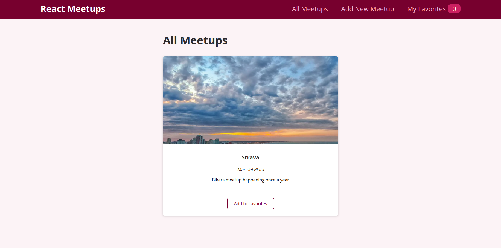
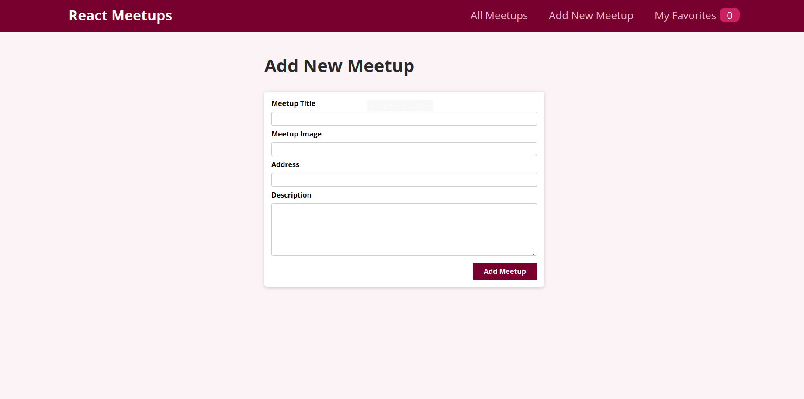
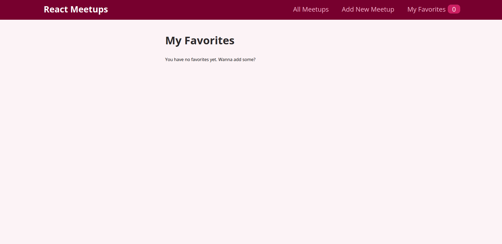

# Meetups Tracker - Demo - React
This small website will allow to keep track of meetups that happened, together with a picture and the ability to save favorite meetups.

The main learning goals for this project were:
- Learn how to interact with an API on a backend using Firebase
- Learn how to use React Router
- Keep improving my React skills

## Screenshots 📷

## Built with 🛠️
- JavaScript
- HTML
- CSS
- React

## Authors ✒️
- Agustin Aon - [@aon](https://github.com/aon)
